# libThresholdLogic

A Python library for creating threshold logic Neuron Networks in a declarative way. This library is based primarily on my [MSc Dissertation](Dissertation.pdf) work, and is an improved refactoring of the codebase. One is encouraged to read the dissertation, however a very abridged summary is given below, followed by documentation for the codebase and its example networks.

## Installation

- Clone the repository
- `python -m venv venv`
- `source ./venv/bin/activate`
- `pip install -e .`

Tests executable scripts are available in the `test` folder which correspond to the networks in `src/libThresholdLogic/ExampleNetworks`

## Threshold Logic

### TLDR

The primary component of threshold logic is the (*classical) Perceptron, whose scalar output $y$ for input $\vec{x} \in \lbrace 0, 1 \rbrace ^ n$, weights $\vec{w} \in \mathbb{R}^n$, and bias $b \in \mathbb{R}$ is determined by

$$
y = H(\vec{w} \cdot \vec{x} - b)
$$

where $H$ is the Heaviside step function. (*in modern usage a perceptron employs a smoother transfer function in place of $H$ such as the sigmoid, for suitability within calculus)

With clever choices for $\vec{w}$ and $b$, over which one has freedom, one can create logic gates and ALUs. $\vec{x}$ can be of arbitrary dimension allowing a high degree of connectivity when linking perceptrons' inputs and outputs with each other. This is one of the big advantages over digital (binary) logic, leading to significantly reduced (often $O(n) \to O(\log(n))$) component-count in common ALUs.

### A quick rundown of why we are interested in threshold logic

*nemo igitur vir magnus sine aliquo adflatu divino umquam fuit* - Cicero

Threshold activation is exhibited by biological neurons in nature. Scientific experimentation observing how neurons and synapses react under electrical currents procured their mathematical modelling as dynamical systems of differential equations. One such model is the two Fitzhugh-Nagumo (FHN) equations (1961), simplifying the four differential equations of earlier work done by Hodgkin and Huxley (1952).

$$
\begin{align*}
\dot{x} &= c(y + x - x^3 / 3 + z) \\
\dot{y} &= -(x - a + by) / c
\end{align*}
$$

Bifurcation theory analysis of the FHN equations reveals a neuron reaching its threshold for activation to be equivalent to a limit-cycle dynamical system reaching its first bifurcation orbit. "The location of the singular point
P and hence its stability depends on z" (Fitzhugh, 1961:450).

| z = 0.0, subcricical; orbit-trapped to nullcline-intersection | z = -0.4, supercritical; first orbit |
| - | - |
| 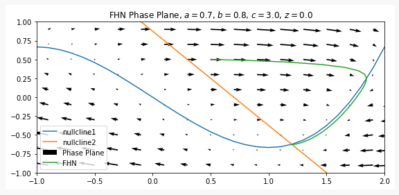 | 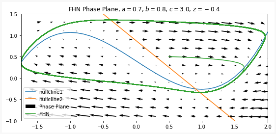 |


In a special choice of hyperparameters of $a = b = 0$ one obtains the equations of the Van der Pol circuit. This can be constructed using electronic components. This motivates us to seek ways to create human-engineered electronic versions of other threshold effect dynamical systems.

One exotic component of interest is the memristor. Similar to the transistor's journey of being hypothesised in the 1920s, and built many years later in the 1940s, the memristor was hypothesised in 1971 and first built in 2008. Fang et al (2022) fork the FHN model, modifying the Van der Pol circuit to use a memristor instead of a non-linear resistor. This uses much less power! They successfully demonstrate threshold logic ALUs in their paper.

A cooler, supercooled even, component is the Josephson Junction (JJ), which uses the Josephson Effect from quantum mechanics, predicted in 1962. Chalkiadakis and Hizanidis (2022) demonstrate that coupling two JJs together creates a 'neuron' which exhibits a threshold effect. These neurons operate one hundred million times faster than a neuron in a human brain! The only problem is we do not yet know how to create 'synapses' (connections between neurons) for JJ neurons, since the threshold effect is exhibited by the relative phase difference of the JJs rather than an output current.

Josephson Junction Neuron, with $\vec{w} \cdot \vec{x}$ supplied by $I_{\text{in}}$, and $b$ supplied by $I_{\text{b}}$
| |
| - |
| 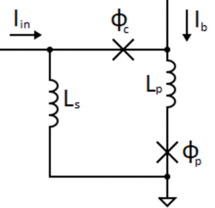 |

To be clear, whilst JJs use a quantum mechanical effect, we could use them in a conventional-computing setting with threshold logic, as well as in quantum-computing which has been done by D-Wave Systems. If synapses were to be discovered, mass-manufacturing of JJs becomes popularised, and cloud computing companies safely house low-temperature supercooled JJ computers for ssh-ing into, **we could be looking at threshold logic Josephson Junction computing overthrowing digital logic transistor computing for the next generational leap of computational power**.

### The codebase

We focus on 'synthetic' threshold logic in this codebase, that is the lossless mathematical derivations and functions, independent of a particular technology such as Josephson Junctions or Memristors. This provides as much portability as possible. Each file within the codebase has good further documentation.

Every network / ALU inherits from the `NeuronNetwork` class and overrides its abstract `__init__` method, within it creating and connecting the network's neurons. This way of declaratively constructing a network, say `my_network`, means that one can peacefully call `my_network(inputs)` without having to think about the evaluation order of the neurons; the `NeuronNetwork.__call__` method is coded to do that, a depth-first algorithm. All one has to provide to `super().__init__` is an input layer of `ProxyNeuron`s and an output layer of neurons, corresponding to the IO of the network. A `ProxyNeuron` is a wrapper class for a `BaseNeuron` component which one intends to provide at a later time. For example one may evaluate the network on its own, which connects `ConstNeuron`s to the input layer, or one may connect networks together, chaining IO. Think of a `ProxyNeuron` like a bare wire sticking out of a 555 timer chip.

## libThresholdLogic.ExampleNetworks

I would definitely recommend [Ben Eater][ben-eater-yt]'s YouTube channel for learning about how computers work at the lowest level.

All of the following networks except `HammingGate` (which came to me recently) are described in the thesis as well. We make use of the term little/big 'bittian' (inspired by endian-ness) when talking about bitwise binary enumeration of numbers.

### `Adders.py`

A simple operation we could ask of a computer is to add numbers together. We start with bitwise addition.

#### `HalfAdder`

Adds two binary bits together, yielding two binary outputs, a 'sum' (1s) bit and a 'carry' (2s) bit.

Observe how pleasant the way of connecting neurons together is.

```py
class HalfAdder(NeuronNetwork):
    def __init__(self) -> None:
        neuron_sum = Perceptron(1.0)
        neuron_carry = Perceptron(1.0)

        neurons = [neuron_sum, neuron_carry]

        # inhibitory connection from carry to sum
        neuron_sum.add_input(-2.0, neuron_carry)

        input_layer = [ProxyNeuron() for _ in range(2)]

        # excitatory connections from inputs
        for neuron_src in input_layer:
            neuron_sum.add_input(1.0, neuron_src)
            neuron_carry.add_input(0.5, neuron_src)

        output_layer = neurons

        super().__init__(input_layer, output_layer)
```

With a corresponding neuron diagram

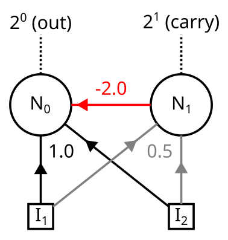

#### `FullAdder`

It would be nice to be able to chain half-adders together for adding two k-bit numbers. The adders would experience a ripple-effect, carrying the carry bits forwards to the next adder each time we add some bits. For this we would need to connect another input to the adder's neurons, which is indeed what we do for a `FullAdder`.

A full adder takes in three inputs, and provides two outputs.

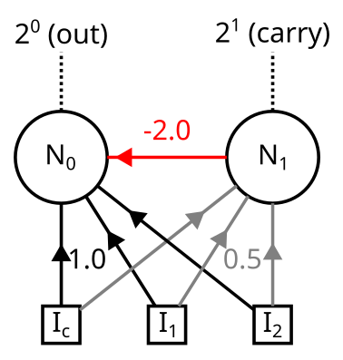

#### `GenericBitAdder`

We go further and develop a generalised $n$-neuron version of the `FullAdder`, the `GenericBitAdder`. Any network with $n$ output neurons can produce at most $2 ^ n$ distinct outputs. The `GenericBitAdder` achieves this with its output corresponding to the binary representation of adding together its $2 ^ n - 1$ input bits; for $i \in \lbrace 0, \dots, n - 1 \rbrace$ the $i$-th output neuron is the $2 ^ i$-s bit.

Observe the carefully chosen pattern of powers of 2 for the weights in the `FullAdder` above. A full justification and mathematical derivation is given in the thesis. A summary is that we extend to the `GenericBitAdder` as follows:

- For each neuron $N_i$, $i \in \lbrace 0, \dots, n - 1 \rbrace$
  - Connect all $2 ^ n - 1$ inputs to $N_i$, each with excitatory weight $1 / 2 ^ i$
  - For each neuron $N_j$, $j \in \lbrace 0, \dots, i - 1 \rbrace$
    - Connect the output of $N_i$ to $N_j$ with inhibitory weight $2 ^ {i - j}$.

The `FullAdder` is a 2-neuron `GenericBitAdder`.

To create a $2 ^ n - 1$ bit adder with transistors / digital logic would require $O(2 ^ n)$ transistors, however with neurons / threshold logic we require only $n$ neurons. This is a logarithmic reduction in the complexity of component count, which is a very non-trivial feat to achieve.

> Typical `GenericBitAdder` neuron connections
> 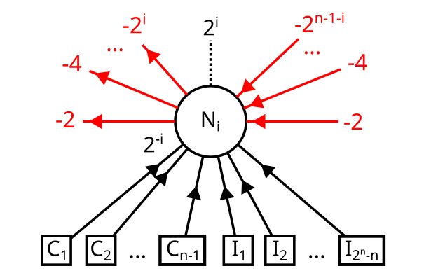

> Example of n = 3
> 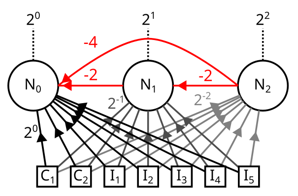

#### `GenericNumberAdder` - SIMD addition

When connecting `GenericBitAdder`s together in a ripple carry fashion, one considers the upper $n - 1$ output neurons as carry bits, which are carried correspondingly into the next $n - 1$ adders. Consequently we reserve $n - 1$ of each adder's $2 ^ n - 1$ inputs for carry bits, leaving us with $2 ^ n - n$ 'real' inputs, as seen in the images above. Chaining together $K$ adders we create a $2 ^ n - n$ input $K$-bit SIMD adder.

In other words we can simultaneously add together $2 ^ n - n$ binary numbers each with $K$ bits, using only $Kn$ neurons. This is an operation which with transistor based hardware is exclusive to GPUs, and high end CPUs with AVX instructions, due to the high number of transistors required.

### `LogicGates.py`

Part III of the thesis establishes the compatibility of threshold logic and digital logic. Specifically we embed digital logic into threshold logic, and come up with optimisations-to / extensible-forms-of common logic gates.

#### `NOT` - a humble inverter, often not required

Since we allow negative weighting of inputs in our networks, a `NOT` gate is hardly ever required, but here it is anyways.

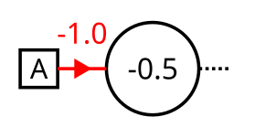

#### `AND` and `NAND`, `OR` and `NOR` - splitting the plane

We consider these two families of gates next. One recognises that the formula $\vec{w} \cdot \vec{x} - b$, used in the neuron's activation formula, characterises the equation of a plane (at least up to normalisation of $\vec{w}$). Indeed with sensible choices of $\vec{w}$ and $b$ we can isolate $(1,1)$ and $(0,0)$ to create `AND` and `OR` gates respectively. The complimentary side of the planes form `NAND` and `NOR` gates respectively, with the weights and biases recoverable by rearranging the formula $\vec{w} \cdot \vec{x} - b < 0$ into $-\vec{w} \cdot \vec{x} - (-b) > 0$

| `AND` and `NAND` | `OR` and `NOR` |
| - | - |
| 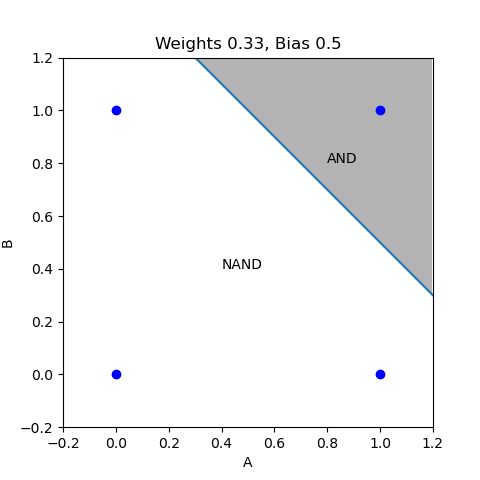 | 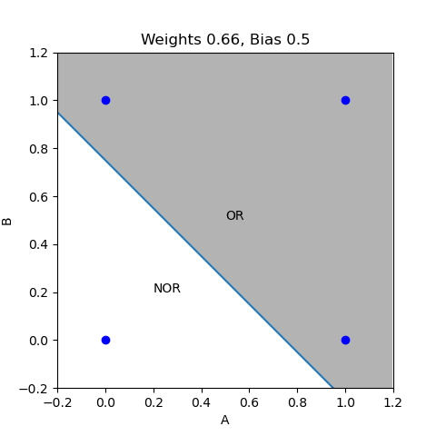 |

| `AND` | `NAND` | `OR` | `NOR` |
| - | - | - | - |
| 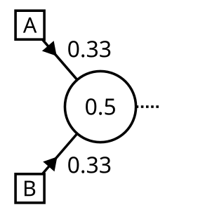 | 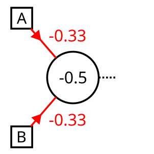 | 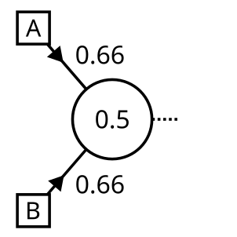 | 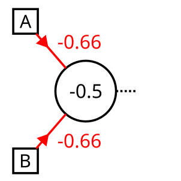 |

#### Beyond two inputs

This is where things get powerful! The formulae for `AND` and `OR` (and their complements) can easily be generalised with threshold logic such that all, or any, of $n$ inputs activate the neuron. These four classes accept a keyword argument `n_inputs`, which by default is 2.

We do the derivations in our thesis, considering shaving off the $\vec{0}$ and $\vec{1}$ corners of an $n$-dimensional unit hypercube. All weights have unit magnitude, and the biases are given below

| Multi-input `AND` | Multi-input `OR` |
| - | - |
| 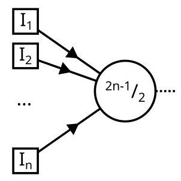 | 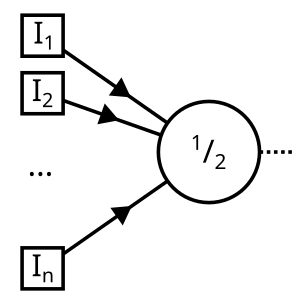 |

$n$-input digital logic gates would take $O(n)$ transistors, and up to $O(n)$ propagation time to activate, however threshold logic achieves all this with one neuron.

#### `GAND` and `GNAND` - generalised bit selection

The most generalised versions of the mono-neuron gates achieved in the thesis (though now superseded by `HammingGate` further on) are the `GAND` and `GNAND` gates. Short for Generalised-(N)AND, these provide arbitrary bit-selection / exclusion of the form $\vec{x} = \vec{x_0}$ and $\vec{x} \neq \vec{x_0}$.

The gates take in a single argument `seek_vector` / `flee_vector`, a tuple corresponding of bits that should be sought or not.

| `GAND` | `GNAND` |
| - | - |
| 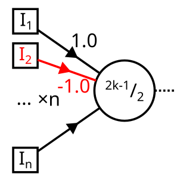 | 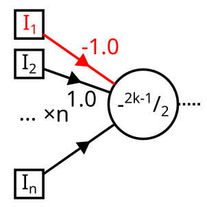 |

#### `HammingGate` - The ultimate $\lbrace 0, 1 \rbrace ^ n$ mono-neuron gate

This gate came to me recently when going back over my work. The `G(N)AND` gates work by checking whether or not their input $\vec{x}$ has Hamming distance zero from their `target_vector` $\vec{v}$. Could we generalise this to Hamming distance $d$, to create a gate representing $B_d[\vec{x_0}]$, the closed ball of radius $d$ with respect to the Hamming metric's topology?

Indeed we can! An adjustment to equation (10.7) to the form

$$
\vec{x} \cdot (2 \vec{v} - 1) = \dfrac{2k - 2d - 1}{2}
$$

reduces the tolerance of the `GAND` gate; the weights end up the same, but the bias has been reduced by $d$. This can be seen as translating the plane to include more corners of the $n$-dimensional cube.

Furthermore if one really thinks hard, one notices that $\sim B_d[\vec{x_0}] = B_{n - 1 - d}[\sim\vec{x_0}]$, that is the negation of a closed ball around $\vec{x_0}$ of radius $d$ is exactly the closed ball of radius $n - 1 - d$ around the bitwise inverse of $\vec{x_0}$. This allows us to unify both `GAND` and `GNAND` flavours of gate into one Hamming metric based gate which we call `HammingGate`.

Hence the inheritance hierarchy in `LogicGates.py` is the following:

- `HammingGate`
  - `GAND`
    - `AND`
    - `NOR`
  - `GNAND`
    - `NAND`
      - `NOT`
    - `OR`

The amazing things we can achieve with just one neuron!

#### `XOR` and `XNOR` - Non-linearly separable gates

XXX TODO Finish this off

### `Multipliers.py`

#### `BitMultiplier2x2`

#### `GenericBitMultiplier`


[ben-eater-yt]: https://www.youtube.com/watch?v=dXdoim96v5A
